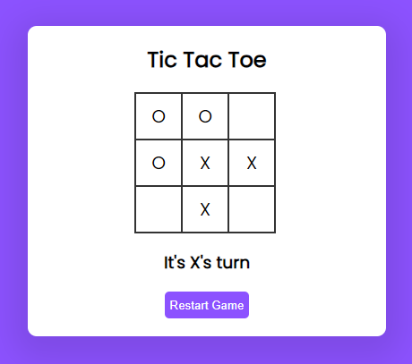

# Tic-Tac-Toe Game

This is a classic two-player Tic-Tac-Toe game implemented using HTML, CSS, and JavaScript.

[]

## Features

* Two-player gameplay
* Visually appealing board design with clear player markers (X and O)
* Smooth turn-taking logic
* Win detection for horizontal, vertical, and diagonal lines
* Draw detection when the board is full

## How to Play
Players take turns clicking on empty squares on the board.

* The first player to complete a row, column, or diagonal of their symbol (X or O) wins.
* If all squares are filled without a winner, the game ends in a draw.

## Getting Started

Here's an way to get started :

1. **Download the Zip File:**

   Download the project as a zip file from the repository (look for a "Download Zip" button or similar option).

2. **Extract the Files:**

   Unzip the downloaded file to a folder on your computer.

3. **Open the Game:**

   Open the `index.html` file from the extracted folder in any web browser. You can do this by either dragging the file into your browser window or using the following methods depending on your operating system:

     * **macOS/Linux:** `open index.html`
     * **Windows:** `start index.html`

4. **Enjoy the Game!**

   The Tic-Tac-Toe game should now be running in your browser.

